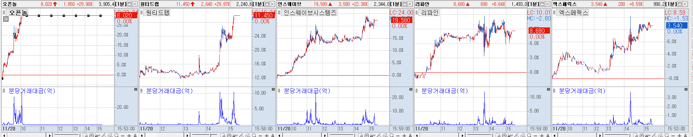

# 11월

{: .no_toc }

  

    Table of contents
  

  {: .text-delta }
- TOC
{:toc}

<!------------------------------------ STEP ------------------------------------>

### 2023-11-20(월)

* **장전 Check 뉴스**
  * **[한동훈]** [커지는 한동훈 총선 등판론…출마결단 임박 관측도](https://www.yna.co.kr/view/AKR20231119049700001?input=1195m)
    * **📈 관련주**: 오파스넷 / 체시스 / 노을 / 오리콤 / 부방 / 금비/ 유니드비 / 태양금속 / 핑거 / 디티앤씨 / 디티앤씨알오
  * **[AI반도체]** [삼성·네이버 'AI 반도체' 상용화 임박](https://www.etnews.com//20231117000184)
    * **📈 관련주**: 폴라리스오피스 / 오브젠 / 오픈엣지테크놀로지 / 나무기술 / 가온칩스 / 에이디테크놀로지 / 코아시아 / 크라우드웍스 
  * **[2030부산엑스포]** [[ZD브리핑\] 윤 대통령, 경제사절단 이끌고 영국 국빈 방문](https://n.news.naver.com/mnews/article/092/0002311980?sid=105)
    * **📈 관련주**: 메쎄이상 / 시공테크 / KNN / 케이엘넷
  * **[시간외 상승] [마이코플라즈마]**  [질병청, 1달 새 마이코플라스마 폐렴균 입원환자 2배 증가…1~12세 80%](https://www.asiatoday.co.kr/view.php?key=20231117010011372)

    * **시간외 상승:** 위더스제약 / 국제약품
    * **📈 관련주**
      * **마이코플라즈마 폐렴:** 한국파마 / 현대바이오
      * **인공호흡기:** 맥아이씨에스 / 메디아나 / 씨유메디칼 / 한컴라이프케어
  * **[스페이스 X]** [8분만에 실패·폭발했는데 “축하한다”…찬사 쏟아진 스페이스 X, 왜](https://n.news.naver.com/mnews/article/009/0005217420?sid=101)
  
    * **📈 관련주**: 컨텍 / AP위성 / 켄코아에어로스페이스 / 인텔리안테크 / 제노코 / 쎄트렉아이
  * **[유가 인상]** [출렁이는 국제유가…수요둔화, OPEC+ 감산 우려 속 등락폭↑ ](https://view.asiae.co.kr/article/2023111810142101640)

    * **📈 관련주**: 흥구석유 / 중앙에너비스 / 한국석유 / SH에너지화학 / 위즈코프
  * **[럼피스킨병]** [고창, 소 럼피스킨 확산세 심상찮다](https://news.kmib.co.kr/article/view.asp?arcid=0924330848&code=11131424&cp=nv)
  
    * **📈 관련주**: 마니커에프앤지 / 마니커 / 하림 / 우리손에프앤지 / 동우팜투테이블 / 팜스토리 / 대성미생물 / 진바이오텍 / 파루 / 우진비앤지 / 이글벳 / 중앙백신 / 우정바이오 / 씨티씨바이오
  * **[라면]** ['60주년' K-라면 수출 올해 1조 첫 돌파…9년째 '사상 최대' ](https://n.news.naver.com/mnews/article/001/0014341156?sid=101)

    * **📈 관련주**: 농심 / 농심홀딩스 / 오뚜기 / 삼양식품
  * **[마스크]** [“마스크, 다시 꺼내야”…초미세먼지, 작년보다 더 ‘악화’ 전망](https://n.news.naver.com/mnews/article/243/0000052951?sid=101)
  
    * **📈 관련주**: 케이엠 / 케이에스피
  
* **Chart**

  * **[한동훈]** : 장전 이슈

    

    

    * 디티앤씨알오 / 디티엔씨 / 부방 상한가
    * 이후 분당거래대금이 낮았던 금비 / 디지캡 순환매 기회 

  * **[한동훈-이민정책]** : 장중 수급 이동

    

 

### 2023-11-21(화)

* **장전  Check 뉴스**

* **Chart**
  * 주도 이슈가 많아 순환매 기회 없었음

 

### 2023-11-22(수)

* **Comment**

  * 위니에에이드 회생절차 개시 후 거래재개에 위니아 그룹주들 상승 

    의대 입학 정원 수요조사 결과 발표에 교육/온라인 교육 섹터 상승

    STO 장내시장 거래 규제 샌드박스 승인기대감 STO 섹터 상승

    엔비디아 실적 발표 후 시간외 하락에 엔비디아 관련주, 반도체 주들은 살짝 조정을 받을 수 있어 보입니다.

    정치인맥주/ 교육섹터/ STO 섹터 와 그린비즈니스 위크가 오늘부터 시작입니다. 수소를 비롯한 신재생에너지 섹터 흐름 살펴보세요

* **장전  Check 뉴스(금일 관심 이슈 / 테마)**

  * **[시간외상승] [엔비디아] [엔비디아, AI칩 호황에 매출 3배, 순익 7배↑…시장 예상치 웃돌아**](https://www.edaily.co.kr/news/read?newsId=01292326635808344&mediaCodeNo=257&OutLnkChk=Y)

    * **관련주**

      **엔비디아:** MDS테크(5.20%) / 아이크래프트(4.69%) / 씨이랩(3.82%) / 제이씨현시스템(2.00%)

      **HBM:** SK하이닉스 / 이수페타시스 / 한미반도체 / 레이저쎌 / 프로텍 / 코세스 / 피에스케이홀딩스 / 인텍플러스 / HPSP / 에스티아이

  * [2차전지] [테슬라, 2년내 인도에 20억달러 규모 EV 공장 설립](https://n.news.naver.com/mnews/article/015/0004916729?sid=101)

  * [한동훈] [대전 찾은 한동훈 "여의도 300명 아닌 5천만 문법 쓸 것"](https://n.news.naver.com/mnews/article/448/0000437088?sid=100)

    * ✅ 시장에 메인 주도섹터가 부재하게 되어 적당히 재미가 없다면, 한동훈 관련 테마주들의 움직임이 활발해질 수 있습니다.

* **장전  Check 뉴스(지속 관심 이슈 / 테마)**

  * [바이오] [격세지감 K-바이오, 3분기만에 1조 클럽 '우수수'](https://www.pharmnews.com/news/articleView.html?idxno=234704)
    * 셀트리온 그룹의 강한 추세가 이어지고 있습니다. 상단 주요 자리 돌파가 얼마 남지 않았는데, 성공적인 돌파 이후에 상승 추세가 유지된다면, 타 개별 바이오 종목들로 상승세 확산이 나올 가능성이 높습니다.
  * [반도체] [물량 던지던 외인…"대형 반도체株만 싹쓸이" 2.4조 담았다](https://n.news.naver.com/mnews/article/008/0004964341?sid=101)
  * [AI] ["MS가 쿠데타 일으켰다"…전세계 AI 대격변(종합)](https://n.news.naver.com/mnews/article/001/0014345809?sid=104)
  * [로봇] [로봇 200대 종횡무진… 최적 알고리즘 생산 ‘스마트팩토리’](https://n.news.naver.com/mnews/article/014/0005103992?sid=101)
    * 두산로보틱스 외 다른 로봇주들은 한숨 쉬어가고 있는 흐름이네요
  * [폐배터리] [‘전기차’ 친환경의 역설, 환경 위협 ‘폐배터리’…위기를 기회로](https://n.news.naver.com/mnews/article/032/0003262656?sid=101)
    * 당장은 재미없지만, 폐배터리는 2차전지의 성장성이 담보된다면, 함께 커갈 수 밖에 없는 산업
  * [자동차부품] [현대차, 브랜드가치 26.3조원…글로벌 32위로 3단계 상승](https://n.news.naver.com/mnews/article/008/0004964449?sid=101)
  * [우주항공] [소형발사체 개발 기업 뭉쳤다](https://n.news.naver.com/mnews/article/015/0004916715?sid=105)
  * [비만치료제] [비만주사 맞으며 추수감사절 맞는 미국…기름진 음식 소비 감소하나](https://n.news.naver.com/mnews/article/016/0002227794?sid=104)

* **Chart**
