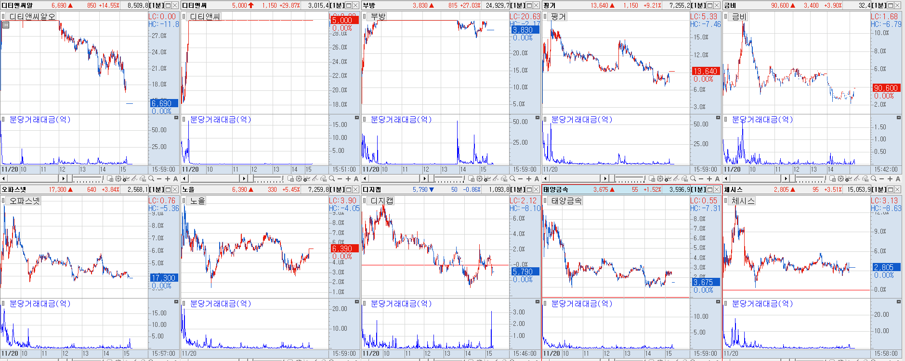
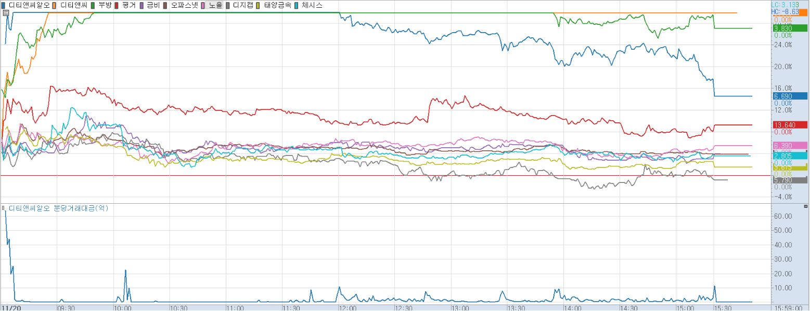

# 11월

{: .no_toc }

  

    Table of contents
  

  {: .text-delta }
- TOC
{:toc}

<!------------------------------------ STEP ------------------------------------>

### 2023-11-20(월)

* **장전 Check 뉴스**
  * **[한동훈]** [커지는 한동훈 총선 등판론…출마결단 임박 관측도](https://www.yna.co.kr/view/AKR20231119049700001?input=1195m)
    * **📈 관련주**: 오파스넷 / 체시스 / 노을 / 오리콤 / 부방 / 금비/ 유니드비 / 태양금속 / 핑거 / 디티앤씨 / 디티앤씨알오
  * **[AI반도체]** [삼성·네이버 'AI 반도체' 상용화 임박](https://www.etnews.com//20231117000184)
    * **📈 관련주**: 폴라리스오피스 / 오브젠 / 오픈엣지테크놀로지 / 나무기술 / 가온칩스 / 에이디테크놀로지 / 코아시아 / 크라우드웍스 
  * **[2030부산엑스포]** [[ZD브리핑\] 윤 대통령, 경제사절단 이끌고 영국 국빈 방문](https://n.news.naver.com/mnews/article/092/0002311980?sid=105)
    * **📈 관련주**: 메쎄이상 / 시공테크 / KNN / 케이엘넷
  * **[시간외 상승] [마이코플라즈마]**  [질병청, 1달 새 마이코플라스마 폐렴균 입원환자 2배 증가…1~12세 80%](https://www.asiatoday.co.kr/view.php?key=20231117010011372)

    * **시간외 상승:** 위더스제약 / 국제약품
    * **📈 관련주**
      * **마이코플라즈마 폐렴:** 한국파마 / 현대바이오
      * **인공호흡기:** 맥아이씨에스 / 메디아나 / 씨유메디칼 / 한컴라이프케어
  * **[스페이스 X]** [8분만에 실패·폭발했는데 “축하한다”…찬사 쏟아진 스페이스 X, 왜](https://n.news.naver.com/mnews/article/009/0005217420?sid=101)
  
    * **📈 관련주**: 컨텍 / AP위성 / 켄코아에어로스페이스 / 인텔리안테크 / 제노코 / 쎄트렉아이
  * **[유가 인상]** [출렁이는 국제유가…수요둔화, OPEC+ 감산 우려 속 등락폭↑ ](https://view.asiae.co.kr/article/2023111810142101640)

    * **📈 관련주**: 흥구석유 / 중앙에너비스 / 한국석유 / SH에너지화학 / 위즈코프
  * **[럼피스킨병]** [고창, 소 럼피스킨 확산세 심상찮다](https://news.kmib.co.kr/article/view.asp?arcid=0924330848&code=11131424&cp=nv)
  
    * **📈 관련주**: 마니커에프앤지 / 마니커 / 하림 / 우리손에프앤지 / 동우팜투테이블 / 팜스토리 / 대성미생물 / 진바이오텍 / 파루 / 우진비앤지 / 이글벳 / 중앙백신 / 우정바이오 / 씨티씨바이오
  * **[라면]** ['60주년' K-라면 수출 올해 1조 첫 돌파…9년째 '사상 최대' ](https://n.news.naver.com/mnews/article/001/0014341156?sid=101)

    * **📈 관련주**: 농심 / 농심홀딩스 / 오뚜기 / 삼양식품
  * **[마스크]** [“마스크, 다시 꺼내야”…초미세먼지, 작년보다 더 ‘악화’ 전망](https://n.news.naver.com/mnews/article/243/0000052951?sid=101)
  
    * **📈 관련주**: 케이엠 / 케이에스피
  

* **Chart**

  * **[한동훈]** : 장전 강한 이슈

    

    

    * 디티앤씨알오 / 디티엔씨 / 부방 상한가
    * 이후 분당거래대금이 낮았던 금비 / 디지캡 순환매 기회 

* [] 
