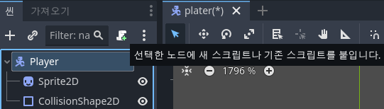

# Starting Out
{: .no_toc }

<details open markdown="block">
  <summary>
    Table of contents
  </summary>
  {: .text-delta }
- TOC
{:toc}
</details>
<!------------------------------------ STEP ------------------------------------>

* [Udemy URL](https://www.udemy.com/course/create-a-complete-2d-arena-survival-roguelike-game-in-godot-4/learn/lecture/36607356#overview)

## STEP 1. Godot4 Download

### Step 1-1. Godot4 다운 및 프로젝트 생성

* [Download URL](https://godotengine.org/)
  * Godot Engine 4.2 64 bit · 30 November 2023
* **에디터 별도 설치 없이 바로 실행 가능**
* **프로젝트 만들기**
  * 렌더링 : Forward+
  * 버전 컴트롤 메타데이타 : Git(강의는 None)

### Step 1-2. 에디터 기능 다듬기

* **기본 시작은 3D로 세팅 되어 있음 → 2D로 변경 필요**
  * [에디터] → [에디어 기능 관리] → [프로필 만들기] → 2D 입력 후 생성
  * 필요 없는 기능들을 비활성화
    * 3D 에디터, 에셋 라이브러리 비활성화
* **폴딩 형식 변경(항상 펴지게)** 
  * [에디터] → [에디터 설정] → [인스펙터] →  [폴딩 비활성화] 체크
  * 인스펙터에서 노드의 모든 속성이 항상 보이게 됨(매번 눌러서 찾는데 노동력 소모 방지)

<br>

## STEP 2. Creating Player

### Step 2-1. 에셋 파일 받기 및 적용

* **케니 에셋(Tiny Dungeon) 사용**
  * [Download URL](https://www.kenney.nl/assets/tiny-dungeon)
* **파일시스템에서 `scenes/player` 폴더 생성** 
  * `Tiles/tile_0096.png`(케릭터 개별 이미지 파일)를 `scenes/player` 폴더 내로 이동
  * `player.png`로 이름 바꾸기

### Step 2-2. 씬 만들기

* **씬 : 파일에 저장된 노드들의 집합**
  * 전체 환경이 될 수 있고 개별적인 것일수도 있음
  * 아이템, 능력, 스킬 등
* **케릭터 바디 루트노드 생성**
  * [씬] → [다른 노드]
    * Node → CanvasItem → Node2D → CollisionObject2D → PhysicsBody2D → CharacterBody2D
  * 케릭터 바디가 지형과 충돌 / 중력, 마찰 같은 물리학 영향 받지 않음
* **케릭터 바디 이미지 노드 생성**
  * [씬] → [CharacterBody2D] 우클릭 후 [Add Child Node]
    * Node → CanvasItem → Node2D → Sprite2D
  * **노드의 모든 노드는 기본 유형의 노드를 상속 받음**
    * Sprite2D 노드는 Node2D 및 CanvasItem 속성 상속
* **씬 저장 하기**
  * [씬] 에서 Ctrl + S 클릭
    * `scenes/player` 폴더 안에 `player.tscn`으로 저장
  * CharacterBody2D 노드 이름 Player 변경(저장 파일과 이름 맞추기)
* **케릭터 바디 이미지 입히기**
  * `player.png` 이미지 파일을 파일시스템에서 [Sprite2D 인스펙터]의 [Texture 항목]에 드래그엔 드롭
  * 스프라이트가 흐릿하게 보임 → 필터 설정
    * [프로젝트] → [프로젝트 설정] → [렌더링] → [텍스처]
      * 기본 텍스처 필터 : Linear → Nearest(픽셀아트는 가장 가까운걸 사용)
* **케릭터 오프셋 변경**
  * [Sprite2D 인스펙터] → [Offset] 
    * y 축 클릭 후 케릭터이미지가 빨간줄 바로 위에 서도록 위치 변경
* **케릭터 충돌 방지용 노드 추가**
  * [씬] → [Player] 우클릭 후 [Add Child Node]
    * Node → CanvasItem → Node2D → CollisionShape2D
    * [CollisionShape2D 인스펙터] → [Shape] → [New CircleShape2D]
      * Shape 한번 더 클릭 후 원 크기 변경
      * Transform에서 위치 조정하여 Player 안쪽에 딱 맞게 변경
    * 네모로 만들 경우 틈에 끼거나 하는 경우가 발생 / 코너 돌 때 더 매끄러운 원 선호함

<br>

## STEP 3. Player Movement

### Step 3-1. 스크립트 추가

* **Player 노드 스크립트 추가**

  

  * 위 녹색 스크롤 초록색 플러스 아이콘 클릭
  * 템플릿: Node:Default 변경

* 입력 맵에 키 추가

  * [프로젝트] → [프로젝트 설정] → [입력 맵]  → 새로운 액션 추가
    * move_right, left, up, down 추가
  * 추가된 엑션의 [+] 클릭 후 버튼 입력
    * w, a, s, d 와 화살표 각 방향 입력

* **`player.gd`**

  * 트리 속에 가장 아래 Node 부터 준비가 됨. Parent Node가 준비됬다는 의미는 모든 Child Node가 준비 됨을 의미

  ```python
  extends CharacterBody2D
  
  # const : 변경할 수 없는 변수
  const MAX_SPEED = 200 # 케릭터 최대 속도 설정
  
  
  # Called when the node enters the scene tree for the first time.
  func _ready():
  	pass # Replace with function body.
  
  
  # Called every frame. 'delta' is the elapsed time since the previous frame.
  func _process(delta):
  	var movement_vector = get_movemment_vector()
  	# 움직일 방향 찾기
  	var direction = movement_vector.normalized()
  	# 케릭터 움직임 속도 설정
  	# 속도 속성 확인 : F1 > CharacterBody2D > 속성 부분에서 확인 가능
  	velocity = direction * MAX_SPEED
  	move_and_slide()	# F1 확인해보면 velocity에 기반해 케릭터 바디를 움직인다고 나옴
  
  func get_movemment_vector():
  	var x_movement = Input.get_action_strength("move_right") - Input.get_action_strength("move_left")
  	var y_movement = Input.get_action_strength("move_down") - Input.get_action_strength("move_up") 	# 아래 방향이 양수가 되도록 설정
  	return Vector2(x_movement, y_movement)
  ```

* **케릭터가 움직일 메인 씬 만들기**
  * [씬] → [새 씬]
  * [다른 노드] 
    * Node
  * 이름 Node에서 Main 변경
  * `scenes/main/main.tscn` 다름이름으로 저장
  * [Main 노드] 우클릭 Instantiate Child Scenes
    * player.tscn
  * 케릭터 중앙 쪽으로 배치
  
* **Main 씬에서 F5 눌러 실행**
  
  * 씬 창에서 Main Node 클릭 → F5 → [현재 씬 선택] 클릭
  * **[Trouble Shooting]** 씬 창에서 Main Node 클릭 안하고 실행해서 계속 응답없음 발생

<br>

## STEP 4. Creating a TileMap

### Step 4-1. 디스플레이 설정

* **디스플레이 설정**
  * [프로젝트] → [프로젝스 설정] → [Display] → [Window] 
    * 뷰 포인트 높이, 넓이 : 640 x 360 설정 (전형적인 16*9 비율이고 저해상도 픽셀아트(16X16)에 적절)
    * 스트레치 모드 : viewport 변경
    *  Viewport 스트레치 모드는 게임의 전체 화면 크기에 적용되고, Canvas 스트레치 모드는 개별적인 객체에 적용
    * 고급설정 클릭 후 Window 넓이, 높이 오버라이드 : 1280X720(또는 1920 X 1080)
* 실행 후 정상적으로 동작되는지 확인

### Step 4-2. TileMap 노드 생성

* **TileMap 노드 생성**

  * [Main 노드] 우클릭 후 Add Child Node에서 [TileMMap] 노드 생성

  * [TileMap] 노드를 [Player] 노드 위로 이동
    * **Node 2D 드로우 순서는 트리 위치 순서대로 되기 때문**
      * TileMap 먼저 그리고 그 위에 Player가 드로잉됨

### Step 4-3. tileset 리소스 생성

* **`tileset.tres` 설정**

  * `./resources` 폴더 생성
  * 해당 폴더 우클릭 후 새로만들기 → resource
    * TileSet 선택
    * `tileset.tres` 으로 저장

  * 이전에 다운받은 `kenney_tiny-dungeon/Tilemap/tilemap_packed.png` 파일을 새로 폴더만들어서  `./assets/environment/tilemap_packed.png`로 이동

  * `tileset.tres` 클릭 후 `tilemap_packed.png`를 tileset 에디터에 드래그엔드롭
    * 자동 타일 생성 [아니요] 클릭
  * 원하는 타일 클릭(강의에서 3개)
  * [tileset.tres 인스펙터] → [Terrain Sets : 모드 Match Conrners and sides] → [요소 추가]
    * Name : floor 변경
  * Tileset 에디터
    * [칠하기]
    * 칠하기 속성: 지형 선택
      * Terrain set : Terrain Set 0 선택
      * Terrain : floor 선택
      * 다시 한번 타일 클릭
      * 클릭한 타일에 비트마스크를 다시 한번 모두 선택
        * 비트마스크???? 
    * 칠하기 속성: 확률 선택
      * 타일 별로 나오고자 하는 횟수(확률) 선택(강의에서는 20, 5, 1)

### Step 4-4. TileMap 노드 설정

* 파일시스템의 `tileset.tres`를 [TileMap 인스펙터] Tile Set에 드래그앤드롭
* [타일맵에디터] → [지형] → [floor] 선택
* 직접 마우스로 하나씩 그리거나 네모 클릭 후 드래그엔드롭해서 크게 그릴 수 있음

<br>

## STEP 5. Game Camera

### Step 5-1. Camera 노드 추가

* 새 씬 추가(Ctrl+N), 다른 노드 추가(Ctrl+A) 

  * Node → Node2D → Camera2D
  * Node 이름 변경 : GameCamera
  * `./scenes/game_camera/game_camera.tscn` 저장

* 스크립트 추가

* `game_camera.gd`

  ```python
  extends Camera2D
  
  
  # Called when the node enters the scene tree for the first time.
  func _ready():
  	make_current()
  
  
  # Called every frame. 'delta' is the elapsed time since the previous frame.
  func _process(delta):
  	pass
  ```

### Step 5-2. 노드 그룹 지정

* 어떻게 하면 카메라가 케릭터 위치를 파악할 수 있을까? 노드 그룹 지정

* 그룹 역활 : 식별자로 코드 어디든 엑세스 가능
* Player 노드 그룹 생성
  * [Player 노드]  → 노드 분활화면 → 그룹 
    * 그룹 관리  → player 그룹 생성  → 그룹에 속한 노드에 Player 추가

### Step 5-3. Camera 스크립트

* `game_camera.gd`

  ```python
  extends Camera2D
  
  
  # Called when the node enters the scene tree for the first time.
  func _ready():
  	make_current()
  
  
  # Called every frame. 'delta' is the elapsed time since the previous frame.
  func _process(delta):
  	var player_nodes = get_tree().get_nodes_in_group("player")	# player 그룹 노드 배열 반환
  	if player_nodes.size() > 0:		# 배열 사이즈가 0보다 큰 경우
  		var player = player_nodes[0] as Node2D
  		global_position = player.global_position
  ```

* 실행해보면 카메라 안움직임 → 카메라를 따로 설치했기 때문
* **Main 씬에 카메라 삽입**
  * [Main 노드] 우클릭 Instantiate Child Scenes 
    * `game_camera.tscn` 삽입
    * `game_camera.tscn`를 트리 노드 중 제일 위로 이동(카메라 노드는 드로잉 순셍 영향 받지 않음) 

### Step 5-4. Camera 스크립트 개선 

* 이동할 때 약간 뒤로 끌림 개선 및 스무딩 효과 추가

* 카메라 프레임률 독립적 사용

* `game_camera.gd`

  ```python
  extends Camera2D
  
  var target_position = Vector2.ZERO
  
  
  # Called when the node enters the scene tree for the first time.
  func _ready():
  	make_current()
  
  
  # Called every frame. 'delta' is the elapsed time since the previous frame.
  func _process(delta):
  	acquire_target()
  	global_position = global_position.lerp(target_position, 1.0 - exp(-delta * 10))
  	# lerp : 선형 인터폴레이션, 시작과 끝 점 위치 사이 거리를 나타내는 퍼센트로 지정?
  	
  	
  func acquire_target():
  	var player_nodes = get_tree().get_nodes_in_group("player")	# player 그룹 노드 배열 반환
  	if player_nodes.size() > 0:		# 배열 사이즈가 0보다 큰 경우
  		var player = player_nodes[0] as Node2D
  		target_position = player.global_position
  ```

  

