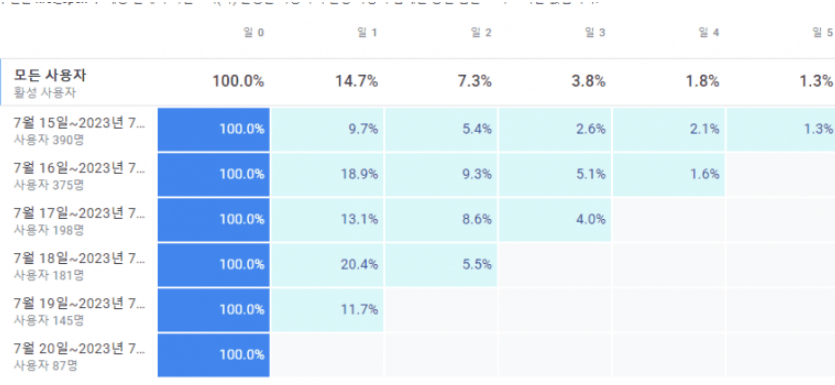
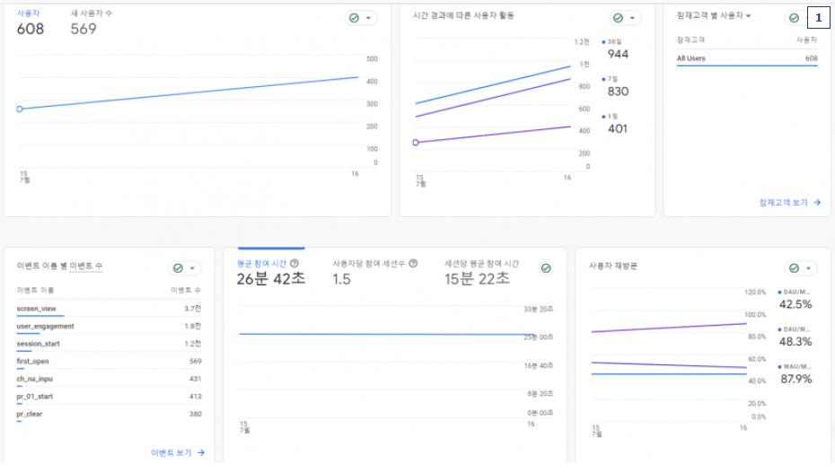
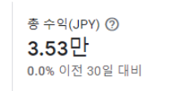
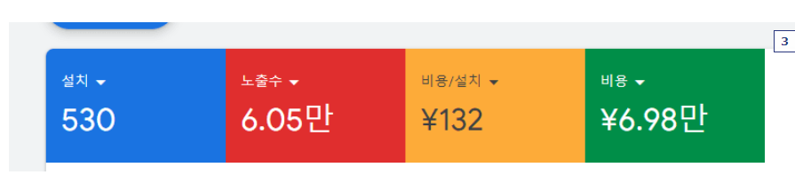
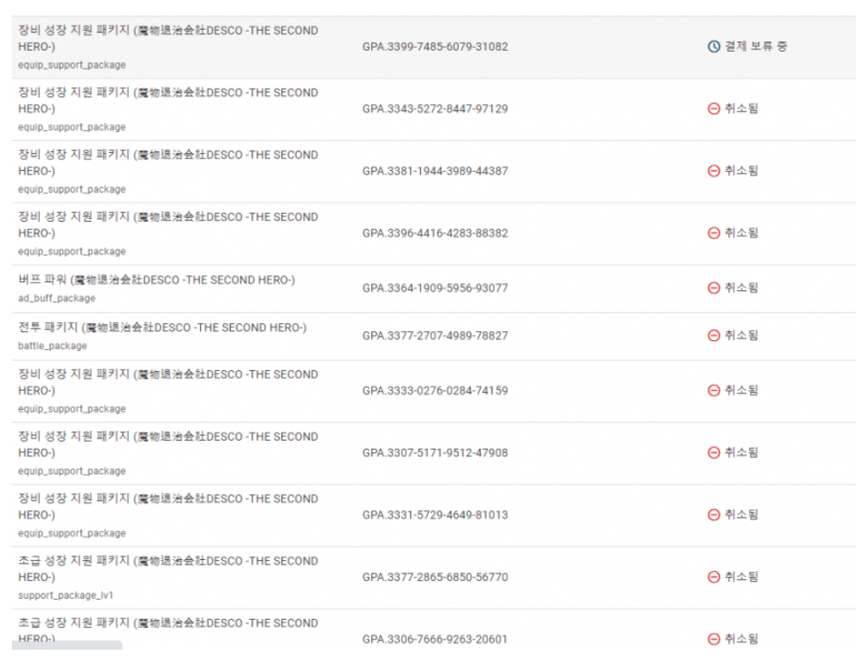

# Review

{: .no_toc }

  

    Table of contents
  

  {: .text-delta }
- TOC
{:toc}

<!------------------------------------ STEP ------------------------------------>

## Step 1. Review_곰돌계곡

### Step 1-1. [240607_[📜일지] 약 4년 동안의 겜개발을 정리하고 그만하려 함](https://gall.dcinside.com/mgallery/board/view/?id=game_dev&no=161783&exception_mode=recommend&s_type=search_subject_memo&s_keyword=%EC%9D%BC%EC%A7%80&page=2)

좀 길어질 것 같아서 내용 구분을 해봄

<주제 요약>

뭔가 일지만 적으면 말투를 어떻게 해야 할 지를 모르겠다 ㅋㅋ

아무튼 약 4년 간의 인디 게임 개발을 하던 걸 이때까지 만든 게임 3주정도만 정리만하고

이제 그만하려 함.

**<첫번째 게임의 출시에 관한 썰과 지금의 기분>**

위 링크에도 보면 첫 출시했을 때의 일지인데 아직도 저 때의 기분이 생생해.

첫번째 게임이라 그런지 UI도 복잡하고 게임 트렌드를 읽지 못해서 방치형과 아이템 파밍과 액션의 그 무언가가 되어버렸지만

넣고 싶은 기능은 억지로 구겨 넣었고, 그런지 정말 정성도 많이 쏟았던 게임이었어.

정성을 쏟는 것과 결과물의 퀄리티가 항상 비례하는 건 아니구나 라는 걸 느꼈고.

게임개발이라는게 프로그래밍 뿐만 아닌 예술적인 감각이 있지않으면 안되는구나 라는것도 뼈저리게 느꼈지.

첫번째 출시한 게임이 "데몬박멸회사 데스코"라는 게임인데 작년 7월출시하고 구글애드에서 광고뿌리는거 2개월간 하다가

게임평은 3점대도 못미치는 쿠소게가 되고 수익은 마이너스만 나고 해서 작년 9월에 광고 중단 했어.

사람의 취향이라는게 다양해서 저런 못난 게임도 취향에 맞으시는

몇몇 분이 몇달간 플레이 해주시면서 이때까지 알던 방치형과는 많이 다르고

재미도 있고 인생게임입니다, 라고 칭찬해주신 분도 계셨어.

그때는 정말 기분은 좋더라.

그래도 다운수는 5천도 안되고 악평에 1일리텐션이 15프로도 간당간당해서 업데이트도 포기했어ㅎㅎ

3년간 개발했던게 객관적을 부족한건 알지만 그래도 결과가 예상보다 더더욱 처참했어서 아마

두달정도 멘탈 회복이 안잡혀서 차기작도 손에 안잡히더라..

**<그리고 두번째 게임 출시>**

작년 10월부터는 두번째 게임을 만들기 시작했어. 장르는 방치형 키우기로 정헀어.

첫번째 게임에서 쌓인 소스와 시스템과 경험들이 있으니 만들어보자고 정하고 열심히 만들었다

.

이번에는 독창적인 시스템은 거의 배제하고 슬라임 키우기 같은 전형적인 키우기 게임을

벤치마킹해서 만들었어.

그래도 4-5개월 정도는 걸리더라 개틀링쏘는 여고생에서 우주를 써는 요리사로 기획이 막막 바뀌고

각종 시스템 제작하니 베타버전은 4-5개월만에 나왔고 그 이후로 컨텐츠 추가 버그수정등을 하고

이틀 전에 두번째 게임을 출시했어.

어떤 게임인지는 딱히 공개는 안하고 싶고 굳이 안해봐도 괜찮아.

전형적인 키우기인지라.

이 게임도 출시하고 지금 이틀 정도 지났는데 수익은 없고 리텐션도 엉망이라 뭐 ㅎㅎ

두번째 게임도 이정도면 재미있는 게임만드는 재능은 딱히 없는거 같아.

<길었던 인디게임개발 생활의 종료>

만들어 보자! 하고 약 4년정도 해온 것 같네. 돈도 많이 쓰고 본업과 병행하면서도 정말 재미있게 해왔다.

이만하면 해볼만큼 했고 나도 지금은 만족하는 것 같다~

첫번째로 출시한 **데몬박멸회사 데스코**만 3주정도의 시간을 들여서 수정하고 출시하고

인디게임개발 생활은 슬 종료할 거야.

데스코 게임이 방치형 RPG인데 원래는 던파같은 액션게임으로 만들고 싶었으니

화면을 가로로 하고 ui들 최소로 하고 전체화면을 전투공간으로 잡고,

주인공 캐릭터를 직접 방향키와 공격키로 컨트롤 하게 하고

그에 따른 영향가는 부분만 수정하고 데스코 액션rpg로 재출시가 목표야

<현재 자동사냥인 데스코를 액션겜화한는 것이 미션>

수정완료까진 일지 다시 올리기 시작할게~

한가지 이글에 오해는 안했으면 하는게

이 글은 푸념글이나 비관하는 글은 아니고

나도 이제 나이도 40이 넘은 상태에 개발도중에 결혼도 하게 되었고 본업과 가정에

충실해야할 시기인 것과 충분히 지금까지 너무 즐겁게 개발해왔어서 즐거운 인생이었다라고

회고하고 스스로 기분 정리차 적는 글임.

글이 좀 우중충할 수 있지만 잘 부탁해용~

<3줄요약>

첫번째 만든 자동사냥방식 게임을 액션게임화로 하고 인디겜 개발에서 벗어나 본업과 가정에 충실

즐거웠다 인디게임개발~ 

늘 응원함 많은 인디게임 개발자분들!

---

### Step 1-2.  [230721_와.. 게임 망해보니 상상했던 것보다 타격이 크네](https://gall.dcinside.com/mgallery/board/view?id=game_dev&no=130986)

얼마전 출시한 게임이 대차게 망했거든.

**<리텐션표>**

**<하루평균 인앱결제 매출>**

7만원 (수수료 떼이기전)

"첫 게임은 원래 망한다"라는 말을 항상 들어왔기 때문에 나도 망할거다 라고

계속 각오를 해왔었는데 실제로 망하니까 뭔가 기분이 오묘~해

첫 게임 출시후에 얻은 경험과 실패로 다음 게임을 만들어 가자라고

마음 먹었던게 지금은 다시 제작의 길을 걷기에 선뜻 발이 나가지질 않아.

개발하는 기간동안 무수히 많은 고민과 시행착오,

본업과 병행하면서 새벽까지 하다 자면서 개발했던 그때

개발이 재미있다고 생각하면서 해왔던 기억이

오히려 지금은 얼마나 힘든지 아니까 압박으로 오는 것 같어.

이게 흔히들 이야기하는 좌절의 시간인가 싶기도해.

잘 털고 일어나서 다시 가느냐 마느냐 이겠지.

나는 인디게임 갤러리를 요 몇년간 지켜보면서 들었던 의문이

몇몇 갤러분들이 게임을 출시 후에 그뒤에는 잘 안보이시는 이유가 궁금했었거든.

안오게 되는 기분을 약간은 알 것도 같아ㅎㅎ

좀 글이 어두워졌는데 굳~이 글을 이렇게 남기는 것은

첫 출시후에 성공하는 사람보다 실패하는 사람들이 많다고들 하잖아?

그래서 혹시 출시를 아직 안해보신 분들이 계시면 마음 단단히 먹고

출시 후의 기분이 어떤지 간접적으로 나마 공유를 해드리고 싶었어.

나는 일단 8월11일까지 최대한 리텐션율 올리도록 좀 더 게임 다듬어보고

그뒤로 어떻게 할지 결정을 해봐야 될것 같아~

그럼 즐겁게 개발들~ 화이팅!

---

### Step 1-3. [230717_[📜일지] [데스코] 출시후 주말 지표공개 한다는 약속대로 공개해 봐](https://gall.dcinside.com/mgallery/board/view?id=game_dev&no=130600)

잘 몰라서 그러는데 구글 애널리틱스에 "참여도" 화면 그대로 찍어왔는데 이거 보여주는게 맞어?

인앱결제 수입은 표기가 엔화라서 약 33만원 정도표기이긴 한데

실제로 테스트한 비용이 있어서 약 17만 정도 수익이 났어.

광고는 스샷을 못 찍었는데 15일과 16일 이틀동안 30달러 수익이 났어.

여기까지 보면 수익이 나서 좋겠다라고 생각 하실 수도 있겠지만

중요한 구글에 태운 광고 비용은...

환율계산하고 하면 약 **63**만원.

그럼 인앱결제비용에서 광고비용을 빼면?

현재 총 **적자만 몇십만원**이야~

수익이 안나도 광고하는 건 겜 제작이 이번이 끝이 아니잖아.

그러니 많은 피드백을 받아두고 또한 운영경험도 쌓고 싶어서 그리고 내 스스로 재미도 있어서

계속 광고태우면서 유저들 반응을 보고 있는 중이긴해.

암튼 지표는 이런데..

**한가지 질문!**

리텐션이라는거 위에 올린 저기 표시된 "사용자 재방문율"의 어떤수치를 보면되?

막 42% 48% 89% 이렇게 적혀있는데 저거라고 하기엔 너무 비정상 적으로 수치가 높아서 말이야.

실제 유저들 계정 만들고 다시 들어오는 사람 엄청 적은거 느끼고 있거든

체감상 한.. 10%-15%될려나..

흔히들 말하는 리텐션은 어디서 보는게 맞어?

---

### Step 1-4. [230715_[📜일지] 이틀 전 겜 출시후 벌어진 벅찬 일들....하아..](https://gall.dcinside.com/mgallery/board/view?id=game_dev&no=130449)

안녕

이틀전에 데몬박멸회사 데스코를 출시했어.
개념에도 보내주고 축하와 비평 다들 고마웠어

첫 출시이다보니 정말 많은 걸 느끼고 있는 하루하루야
이 이틀간 일어난 일들과 느낀 점을 적을까 싶어

1. 현질과 도박류는 싫어한다고 말은 하지만 몸은 원하는 듯

\>내 겜은 뽑아가고 합성해가는 키우기류가 아닌데
첫 오픈때 주인공 동료를 몇번 연속 뽑는거 안준다는 비평들이 있었어.
하지만 몇 연차 해버리는 그런 구조가 아니거든.. 너무 쌔기도하고
고심하다가 동료캐릭의 능력치를 1/10정도로 하향하고 뽑기권 가격도 1/10로하고 카드 합성 식으로 변경했어.

2. BM 아이템만 보고 겜을 바로 판단하시는 분들이 많음

\>네이버 유명 까페에 홍보 올렸는데 판매하는 상품보고 비꼬는 댓글이 달리고 그뒤는 댓글보고 폄하하는 글들이 올라오더라
젤 맘 아팠던건 한탕하고 접으려고 하는 겜취급이더라..
근데 실제는 내 겜은 무과금으로도 모든컨텐츠 즐길수있는데..

3. 그래도 취향에 맞아하시는 분들이 있더라

\>위 까페의 홍보글에 비판만 달리다가
한두분이 내 겜해보고 다른 키우기겜류와 다르게 참신함을 위해
고심한 흔적도 많다하고 파밍하는 재미가 있다.
라고 댓글을 달아주셔서 겜을 칭찬해주셨는데..
그 뒤로는 나쁜 댓글은 안달렸다. 너무 고맙게 생각함..

4. 핵쟁이들이 너무 온다.

아마 한두사람인 것 같은데. 핵을써서 접속하더라..
밴된 인원만 벌써 50계정은 넘음.
이해가 안되는게 유저도 별로없는 내겜에 왜 죽어라 핵쓰면서 하려하는걸까
그리고 구글계정 넘 많이 가진것같은데

5.수익 관련
현재 위 핵 계정제외하면 실제 다운받은 인원은 150명되려나
결제해주시는 분은 4사람정도 되더라
어떤한분은 헤비과금러이신가 10만원 결제해주시더러고
전업으로하기엔 안좋지만 첫겜치곤 사랑해주시는분 있으니 좋네

이제 겨우 이틀인데 일주일즈음 뒤에 상황 또 공유해볼게

핵계정 잡는다고 넘 피곤하네 ㅋㅋ(담주에는 안티치트인가 넣을거임)

긴글 읽어줘서 고마워

일본에서 하시는 분인데..

뭘 어떻게 했는지 모르겠는데 막 아래처럼 결제를 취소를 하더라고

그뒤 세이브파일 뒤져보니 결제보류된 것도 전부 구매처리가 되어 있어서 각종 패키지가 들어가 있더라구.

그래서 일단은 밴해두었고 뭔가 해명같은게 오는거면 풀어주려고 하는데 

위와같이 결제보류되는 것은 구매처리 안되게 하는 것 연구해서 담주중에 처리해야겠어..

이리저리 할게 많네

- *ㅇㅇ* 

  서버 쓰고 있어???
  서버 없이 저런 계정 특정 할 수 없지 않나??

  2023.07.17 00:02:05

- *곰돌계곡* 

  플레이팹으로 쓰고 있어. 음.. 추리로 특정하고 있어;; 일단 국가 특정하고 결제된 시간 특정하고 레벨이 낮은데 광고제거 있고 패키지에서만 가진템을 가지고 있는자.. 이렇게 특정하니 딱나오더라

  2023.07.17 00:03:30

- *곰돌계곡* 

  결제하는사람이 거의없으니 가능한방법 ㅎㅎㅎ

  2023.07.17 00:03:50

- - *ㅇㅇ* 

    ㄹㅇ 어느 겜 가나
    환불충들은 서식하는 것 같다..
    나도 예전에 50만원 환불런 당한적 있음ㅋㅋㅋㅋ

    2023.07.17 00:06:39

  - *곰돌계곡* 

    환불이면 환불이라고 뜨는데 저건 뭔가 결제보류되는 카드로 결제하고 취소를 시키는 방식을 택하나봐..

    2023.07.17 00:08:39 

- *테트라스* 

  저런일 겪으면 화난다기보다 우울함

  2023.07.17 00:18:35

- *에뚜* 

  야박한 유저...

  2023.07.17 00:34:54

- *ㅇㅇ*(1.238)

  지연 구매를 이용해서 아이템만 먹는 방식임. 구글플레이의 결제 방법은 아이템을 구매할 때 카드나 기프트카드로 바로 대금을 지불하는 방법이 있고 아이템을 구매하겠다고 외상을 걸어놓고 후불로 돈을 지불하면 아이템을 지급받는 지연 구매 방식 두 가지가 있음. 정상적인 지연 구매라면 외상을 걸어놨을 때 코드 단계에서 아이템 지급을 막아놓고 입금이 확인된 후에 아이템을 지급하는 단계가 구현되어있어야 함. 근데 기본적인 IAP는 지연 구매에 대한 구현이 되어있지 않기 때문에 지연 구매로 아이템을 구매하면 외상값을 받지 않아도 아이템을 지급하게 됨

  2023.07.17 01:14:55

  삭제

- - *ㅇㅇ*(1.238)

    영어로 deferred purchase 라고 검색하면 이것저것 정보를 얻을 수 있음. 라이센스 계정을 이용해서 IAP 테스트를 하면 느린 결제라는 항목이 있잖아? 이게 지연 구매를 테스트 하기 위한 거임. 지연 결제 하는 비율이 그렇게 많지는 않아서 개인적으로는 아예 지연 결제를 막아버리는 방식을 쓰고 있음. IAP에서 현재 진행되고 있는 구매 요청이 지연 구매인지 체크해서 지연 구매일 경우 팝업으로 지연 구매를 지원하지 않는다는 방식을 사용하고 있음

    2023.07.17 01:21:26

    삭제

  - *ㅇㅇ*(1.238)

    지연 구매를 막아도 어떻게든 뚫어서 어뷰징을 하는 유저가 있기는한데 그래도 이렇게 지연 구매를 막는 것만으로 어뷰징 유저가 상당히 많이 줄어드니까 가능하면 지연 구매를 구현하든 아예 막아버리든 처리를 하는게 좋음

    2023.07.17 01:27:56

    삭제

  - *곰돌계곡* 

    1.238//헉 너무 감사합니다!!

    2023.07.17 02:17:39

- *ㅇㅇ*(14.45)

  인디는 아니지만... 저희팀도 1.238 님 처럼 State가 Pending 이면 서버로 영수증 검증 요청 조차 안보내게 처리해뒀어요. 일반적으로 구매하는 유저들의 경우 펜딩을 걸 가능성이 매우 낮으므로...

  환불의 경우에도 아이템 회수 절차를 거쳐야하는데 유저가 별도의 문의로 환불요청하는게 아니라
  스토어쪽에서 자체 환불하면 주기적으로 조회해서 밴을 때려버리는 식으로 운영하고 있어요. ( 이 부분은 유저한테 미리 고지를 해둠 )

  

---

