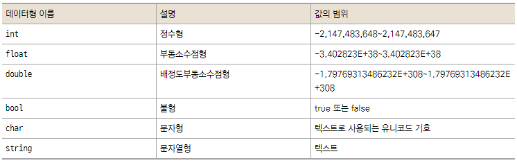

# Basic

{: .no_toc }

<details open markdown="block">
  <summary>
    Table of contents
  </summary>
  {: .text-delta }
- TOC
{:toc}
</details>

<!------------------------------------ STEP ------------------------------------>

```C#
```

## STEP 1. 기본 지식
### Step 1-1. 개요

* 게임의 구분
    * 게임 데이터(게임 구현 리소스 등) : 램   
    * 게임 로직 : CPU 

### Step 1-1. 설계
* 절차(Procedure) 지향 : 함수 기반
    * 단점 : 함수 자체가 순서에 종속적 → 관리 어려움

* 객체 지향(Object Oriented) : 클래스 기반
    * 속성과 기능으로 나누어짐
    * ex) Knight
        * 속성: hp, attack
        * 기능: Move, Attack, Die


### Step 1-2. 디버깅
* 단축키 : F12?

* 브레이크 포인트(중단점) 
    * 숫자 앞 클릭 혹은 F9
    * 마우스 우클릭 옵션으로 해제시 흔적을 남길 수 있어서 유용함
    * 마우스 우클릭 옵션에서 조건을 선택하여 선택적으로 중단 가능
	* ex) 특정 몬스터 id를 옵션으로 하여 추적 가능
    * 개발 중에는 주로 사용 하나, 서비스 시에는 로그로 추적함

* 브레이크 포인트로부터 한단계씩 코드 실행
    * F11

* 프로시저(메소드) 단위 실행
    * F10

* 디버그 실행 중 노란색 화살표를 이동 시켜 실행 순서를 변경하여 실행 가능
    * 조사식을 통해 변수값도 수정하여 확인 가능

* 호출 스텍 : 
    * 몇 번째 레이어(Method) 안에 있는지 나타냄(영화 인셉션 생각)
    * 내가 오게 된 경로(코드 흐름)를 알 수 있음

* 조사식
    * 변수 값 확인 및 디버그 중 수정 가능


<br>

## STEP 2. Variable(데이터)



```C#
using System.Collections;
using System.Collections.Generic;
using UnityEngine;

public class Test : MonoBehaviour  // class 이름은 script 파일 생성명, MonoBehaviour 상속
{

    // ==========enum(열거형) ========== //
    // 클래스 안이나 네임스페이스 내에서만 선언될 수 있음, 메서드 안이나 속성 안에서는 선언되지 않음(일종의 class)
    // 변경 불가한 읽기 전용 깂 (예: 날짜, 색깔 등) 모아 관리 시 유용. 특히, int, bytes 등 정수형 상수 정의 시 유용
    enum Choice
    {
        Rock = 1,
        Paper = 2
        Scissors = 0
    }


    // ===========   구조체	=========== //
    // 클래스 안이나 네임스페이스 내에서만 선언될 수 있음, 메서드 안이나 속성 안에서는 선언되지 않음(일종의 class)
    // 상속 여부 : Class는 상속이 가능하지만, 구조체는 상속이 불가능하다.
    // 형식 차이 : Struct는 값 타입(ValueType)이지만 Class는 참조(Reference Type)
    struct Player
    {
        public int hp;		// 밖에서도 사용 가능하다고 public 선언
        public int damage;
    } 

    void Start()
    {
        // ==========	int		==========
        int age = 30;
        Debug.Log(age);


        // ==========	float	========== 
        // 근사치를 저장함(int와 다른점)
        // ※ float형에 double형 대입시 float형에 들어가지 않는 범위 버려짐(오류 유발)
        // ※ 160.5f 사용(f 미사용시 double형 대입) 
        float height1 = 160.5f;
        float height2;
        height2 = height1;
        Debug.Log(height2);


        // ==========	string	==========
        // 문자와 숫자 더하기 하는 경우 int 변수를 문자열 취급
        // 큰 따음표 사용
        string str = "happy";
        string message = str + age;
        Debug.Log(message);


        // ==========	char	==========
        // 작은 따음표 사용, 한글자만 저장
        char chr = 'R';
        Debug.Log(chr)


        // ==========   bool    ==========
        bool autoPlay = true;


        // ==========   var     =========== 
        // 자동 추론으로 빌드시 타입 대체
        // 가능하다면 타입을 명시하여 가독성을 높이는게 좋음
        var a = 1;
        var b = "STRING";
        var c = 1.0f;


        // ==========   Casting ==========
        // 큰 데이터 타입에서 작은 데이터 타입으로 변환 시 문법
        int a = 100;
        // (X) short b = a;		// Error occurred(큰 형식 → 작은 형식)
        shor b = (short)a; 	// Casting

        float c = a;
        int d = (int)c;		// Casting


        // ===========  String Format   ===========
        // string은 int와 float와 다른 class 해당되기 때문에 태생이 다름(Casting 외 다른 방법 필요)
        // string → int
        string input = Console.ReadLine();
        int number = int.Parse(input);
        Console.WriteLine(number);

        // int → string
        int hp = 100;
        int maxHp = 100;
        string message = string.Format("당신의 HP는 {0} / {1} 입니다", hp, maxHp);  // 예전 방식
        string message = $"당신의 HP는 {hp} / {maxHp} 입니다";		                // 요즘 방식
        console.WriteLine(message)

        
        // ==========    array   ==========
        int[] array = new int[5];

        array[0] = 1;
        array[1] = 2;
        array[2] = 3;
        array[3] = 4;
        array[4] = 5;
        for (int i = 0; i < array.Length; i++)
        {
            Debug.Log(array[i]);
        }

        int[] points = {53, 99, 53, 92, 51};
        int sum = 0;
        for (int i = 0; i < points.Length; i++)
        {
            sum += points[i];
        }
        float average = sum / points.Length;                // 정수로 계산되어 나옴
        float average_float = 1.0f * sum / points.Length;   // 1.0f 곱으로 소수 반환
        Debug.Log(average);
        Debug.Log(average_float);


        // ==========enum(열거형) ========== //
        // 클래스 안이나 네임스페이스 내에서만 선언될 수 있음
        // 메서드 안이나 속성 안에서는 선언되지 않음
        int choice = 3
        switch (choice)
        {
            case (int)Choice.Scissors:
                Console.WriteLine("가위");
                break;
            case (int)Choice.Paper:
                Console.WriteLine("보");
                break;
            case (int)Choice.Rock:
                Console.WriteLine("주먹");
                break;
        }


        // =========== struck(구조체) ========== //
        // 한번에 여러 데이터를 넘기고 관리하는데 유용함
        Player player;
        CreatePlayer("Knight", out player);
        Debug.Log($"hp:{player.hp}, damage:{player.damage}");

    }

    // struck(Player)을 통한 데이터 관리
    static void CreatePlayer(string classType, out Player player)
    {
        if (classType == "Knight")
        {
            player.hp = 10;
            player.damage = 5;
        }
    }

}

```

<!------------------------------------ STEP ------------------------------------>

<br>

## STEP 3. Operation(로직)

```C#
using System.Collections;
using System.Collections.Generic;
using UnityEngine;

public class Test : MonoBehaviour  // class 이름은 script 파일 생성명, MonoBehaviour 상속
{
    void Start()
    {
        // ==========   Four basic Operations    ========== 
        int a = 10 / 3;     // 3
        int a = 10 % 3;     // 1

        int b =a ++;
        // int b = a;
        // a += 1

        int b = ++a;
        // a += 1;
        // int b = a;


        // ===========  Comparison & Logical Operation  ========== 
        // AND  OR  NOT
        // &&   ||   !
    }
}
```

<!------------------------------------ STEP ------------------------------------>

<br>

## STEP 4. 제어문(로직)

```c#
using System.Collections;
using System.Collections.Generic;
using UnityEngine;

public class Test : MonoBehaviour  // class 이름은 script 파일 생성명, MonoBehaviour 상속
{
    void Start()
    {
        // ==========	if	==========
        // 변수 범위: 중괄호 안에서 선언한 변수는 중괄호 안에서만 사용 가능
        bool isDead = ture
        if (isDead)
            Debug.Log("if문");

        int hp = 20;
        if (hp <= 50)
        {
            string inner_str = "전사";
            string log_message = inner_str + "도망!";
            Debug.Log(log_message);
        }
        else if (hp >= 200)
        {
            Debug.Log("공격");
        }
        else
        {
            Debug.Log("방어!");
        }
        // Debug.Log(inner_str); // 변수 범위를 벗어나므로 오류 발생
        

        // ==========   switch  ==========
        // if 문의 축소판이지만 가독성이 좋아 if문에 우선시하여 사용
        // case 값으로 일반 변수 사용시 에러 발생, const 변수(상수), enum 사용 가능
        // case 값으로 하드코딩 대신 상수나, enum 값 사용 
        switch (choice)
        {
            case 0:
                Debug.Log("가위");
                break;
            case 1:
                Debug.Log("바위");
                break;
            case 2:
                Debug.Log("보");
                break;
            case 3:
                Debug.Log("치트키");
                break;
            default:	// else문과 같음
                Debug.Log("해당 없음");
                break;
        }


        // ===========  삼항연산자  ===========
        int number = 25;

        // bool 변수명 = (조건 ? 맞을때 : 틀릴때);
        bool isPiar = ((number % 2) == 0 ? true : false)

        // 아래와 같은 의미
        bool isPair;
        if ((number %2) == 0)
            isPair = true;
        else
            isPair = false;


        // =========== while =========== //
        int count = 5;
        while (count > 0)
        {
            Debug.Log("Hello, World");
            count--;
        }
        

        // 먼저 실행 후 while문 체크(사용빈도 적음)
        string answer
        do
        {
            Console.WriteLine("강사님은 잘생기셨나요? (y/n) : ");
            answer = Console.ReadLine();	// do문 안에서 string answer 시 while문 비교에 사용 안됨(변수범위)
        } while (answer != "y");


        //==========   for   ==========
        // for (초기화식; 조건식; 반복식) {내용문}
        // 초기화식 조건식 내용문 반복식 순서로 실행
        for (int i = 3; i >= 0; i--)
        {
            Debug.Log(i);
        }


        // =========== break =========== //
        // 특정 조건에서 바로 for 문을 뛰어 나옴
        int num = 97;
        bool isPrime = true;

        for (int i = 2; i < num; i++)
        {
            if ((num % i) ==0) 
            {
                isPrime = false;
                break;
            }
        }

        if (isPrime)
            Debug.Log("소수입니다");
        else
            Debug.Log("소수가 아닙니다");

        // =========== countinue =========== //
        // 특정 조건에서 바로 다음 루프 실행
        for (int i = 1; i <= 100; i++)
        {
            if ((i % 3) !=0)
                continue;
            
            // 3이 아닐 때 내용 기재 → if문 보다 가독성이 좋아짐

            Debug.Log($"3으로 나뉘는 숫자 발견 : {i}");
        }

    }
}
```

<!------------------------------------ STEP ------------------------------------>

<br>


## STEP 5. Method(Function)


```c#
using System.Collections;
using System.Collections.Generic;
using UnityEngine;

public class Test : MonoBehaviour  
{
    // Method
    // class 안에 있어야 함
    // 한정자 반환형식 이름(매개변수목록) {}
    // 한정자: static 

    // ==========    인수도 반환값도 없는 메서드    ========== //
    //void: 반환값이 없음을 의미
    void SayHello()
    {
        Debug.Log("Hello");
    }


    // ==========    인수를 출력하는 메서드 ========== //
    void CallName(string name)
    {
        Debug.Log("Hello" + name);
    }


    // ==========    인수와 반환값이 있는 메서드    ========== //
    // 선택적 매개변수: 초기 Method 선언시 인수값을 미리 지정해주면 입력 안해도 가능 
     int Add(int a, int b = 0, float c = 1.0f, double d = 3.0)
    {
        int result = a + b + c + d;
        return result;
    }

    void Start()
    {
        SayHello();
        CallName("Hello");
        int answer = Add(2, d:3.0f);    // 선택적 매개변수 값 지정
        Debug.Log(answer);
    }


    // ==========   ref    ========== //
    // 입력받은 변수를 직접적으로 변화시키고 싶을 때 메모리 참조하겠다는 뜻
    // return 대신 원본 변수로 반환 받는 경우
    // Swap 같은 함수 작성 시 유용
    static void AddOne(ref int number)  
    {
        number = number + 1;
    }

    static void AddOne2(int number) // 일반적으로 해당 방식 사용 권장
    {
        return number + 1;
    }

    void Start()
    {
        // 복사(짭퉁) 참조(진퉁)
        int a= 0;
        AddOne(ref a);  // ref 안쓰면 에러 발생(원본 변환 확인용)
        Debug.Log(a);

        a = AddOne2(a)
        Debug.Log(a);
    }

    static void Swap(ref int a, ref int b)
    {
        int temp = a;
        a = b;
        b = temp;
    }


    // ==========   out    ========== //
    // ref의 경우 실제로 사용하지 않거나 값을 넣어주지 않아도 정상 동작(에러 유발)
    // 다중 반환 가능, 반드시 값 넣어줌 필요   
    static void Divide(int a, int b, out int result1, out int result2)
    {
        result1 = a / b;
        result2 = a % b;
    }

    void Start()
    {
        int num1 = 10;
        int num2 = 3;

        int result1;
        int result2;
        Divide(num1, num2, out result1, out result2);
    }


    // ==========   Method Overloading   ========== //
    // 함수 이름의 재사용
    // 함수 이름이 같다면 매개변수 개수 또는 형식이 달라야함
    static int Add(int a, int b)
    {
        return a + b;
    }

    static int Add(int a, int b, int c)
    {
        return a + b + c;
    }

    static float Add(float a, float b)
    {
        return a + b;
    }

    void Start()
    {
        int result = Add(2, 3);
        float result2 = Add(2.0f, 3.0f);
        Debug.Log(result);
        Debug.Log(result2);

        
    // ===========  재귀함수    =========== //
    static int Factorial(int n)
    {
        if (n <= 1)
            return 1;

        return n * Factorial(n - 1);
    }

    }
}
```

<!------------------------------------ STEP ------------------------------------>

<br>

## STEP 6. Class

* [class와 struck 비교 블로그 url](https://velog.io/@livelyjuseok/C-Struct%EC%99%80-Class%EC%9D%98-%EC%B0%A8%EC%9D%B4.-%EA%B7%B8%EB%A6%AC%EA%B3%A0-%EC%99%9C-%EC%82%AC%EC%9A%A9%ED%95%A0%EA%B9%8C)
* [enum과 class 비교 블로그 url](https://homzzang.com/b/cs-36)
* enum, struct, class 비교
    * enum: 각 상수가 서로 다른 의미를 가지는 상황 적합(복사)
        * casting으로 int 표현 가능
        * ex) 요일
    * struct: 변수가 각기 다른 데이터를 가질 필요가 있을 때(복사)
        * ex) x, y 좌표 포인트
    * class: 인스턴스를 생성하여 각기 인스턴스의 변수값이 변할 필요가 있을 때(참조)
        * ex) 게임 몬스터 인스턴스 생성

```c#
// 참조(ref)
class Knight
{
    // 속성
    public int hp;          // public 모두 사용, 없을 경우 class 내에서만 사용
    public int attack;

    // 기능
    public void Move()
    {
        Console.WriteLine("Knight Move");
    }

    public void Attack()
    {
        Console.WriteLine("Knight Attack");
    }
}


// 복사
struct Mage
{
    public int hp;
    public int attack;
}

class Program
{
    static void KillMage(Mage mage)
    {
        mage.hp = 0;
    }

    static void KillKnight(Knight knight)
    {
        knight.hp = 0;
    }

    static void Main(string[] args)
    {
        Knight knight = new Knight();   // new : 클래스를 가지고 새로운 객체를 만들 때 사용
        knight.hp = 100;
        knight.attack = 10;
        knight.Move();
        knight.Attack();
        KillKnight(knight); // 참조하여 넘기기 때문에 knight.hp는 0

        Mage mage;
        mage.hp =100;
        mage.attack = 50;
        KillMage(mage);     // 복사하여 넘기기 때문에 mage.hp는 100
    }
}
```

<!------------------------------------ STEP ------------------------------------>

<br>

## STEP 9. ETC

```c#
// ==========   Const(상수)   ========== //
Const int GAME_SPPED = 50;
// (X) GAME_SPEED = 15; // Error occurred(Const varient)


// =========== Random   ========== //
Random rand = new Random();
int a = rand.Next(1, 4); // 1, 2, 3 중 랜덤 반환
```

